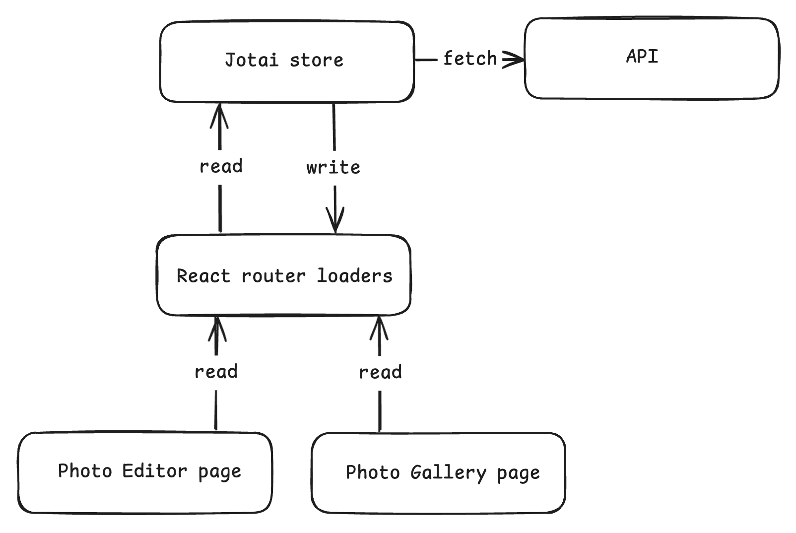

## Quick start

```sh
pnpm install
```

```sh
pnpm dev
```

typically available at http://localhost:5173/

## Overview

This repository contains a showcase project using the [lorem ipsum](https://picsum.photos/) photo api.

Architecture design



The overall idea is to leverage the Router as much as possible, given a URL, e.g., `/page/1/id/1?width=300&height=300&blur=2&grayscale`, the Router will read the current status of that resource in the store, which will fetch the resource from the API and return it back to the Router, finally the Router will present the resource to the page-component.

      ```
      /
      |-- /src
      |   |-- main.tsx          # Main application file
      |   |-- /components       # React components
      |   |-- /hooks            # React hooks
      |   |-- /models           # TS models
      |   |-- /routes           # React Routes and loaders
      |   |-- /pages            # Pages which takes data from routes loaders
      |   |-- /store            # Jotai store
      ```

## Prerequisites

Ensure you have the following installed on your system:

- Nodejs (tested on v20)
- pnpm

## Installation

Follow these steps to set up the project on your local machine:

**Clone the repository**:
    
```sh
git clone https://github.com/phoinixi/photo-gallery.git
cd photo-gallery
```

**Install dependencies**:

```sh
pnpm install
```

## Usage

To run the application, execute the following command:

```sh
pnpm dev
```

typically available at http://localhost:5173/

## Testing

To run the tests, use the following command:

```sh
pnpm test
```
